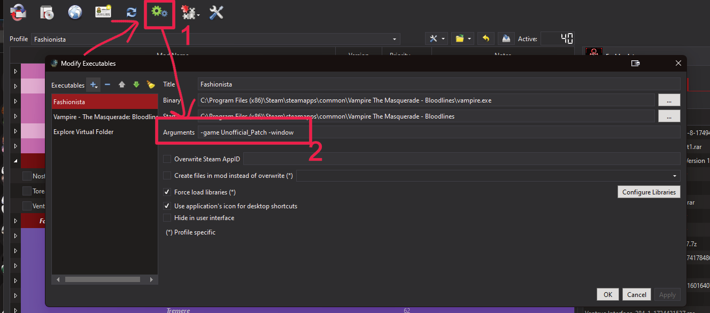

# Common Issues
Here you can find the solutions to common problems people encounter when installing or playing the modlist.

# Contents
- [Common Issues](#common-issues)
- [Contents](#contents)
  - [Install or Update Issues](#install-or-update-issues)
    - [Updating the List Fails](#updating-the-list-fails)
  - [Gameplay Issues](#gameplay-issues)
    - [Mouse Issues](#mouse-issues)
    - [Resolution Issues](#resolution-issues)
    - [Fullscreen or Windowed](#fullscreen-or-windowed)
    - [ENB](#enb)
    - [Game Crashes](#game-crashes)

## Install or Update Issues

### Updating the List Fails

Thed first thing you will want to do is Verify the Game in Steam if using the Steam Version.

We are using Root Builder and I have seen it cause issues with the default game files it some cases and Verifying the Files will fix any issues with the missing files.

If something else is happening head to the discord support channel and post your log and what the issue is and we can see about helping with the issue.

## Gameplay Issues

### Mouse Issues

 If you are unable to look around with the mouse check the options to make sure that Mouse Look is enabled

Options > Mouse Tab > Mouse Look should be checked or if its not on in game press the `;` key

### Resolution Issues

 The game should have most resolution support with the unoffical Patch but I am unnable to test ultrawide displays, changing the resoltions can be done in the main Menu under  

Options > Resolution.

### Fullscreen or Windowed

To swap between Full Screen and Windowed you can edit the launch options by adding  

`-fullscreen`
or
`-windowed`

### ENB

The Default Shortcut to enable or disable the ENB is shift + f12  

### Game Crashes

Make sure you did not change the order of the mods in Mod Organizer or Enable and of the Overhauls if you are on the Main Fashionista Profile.

For Exaimple adding the HD overhaul will crash the Game - The list is already HD and a lot of the mods are not compatable with it if you wish to use the Mod use the alternate Profile for it.