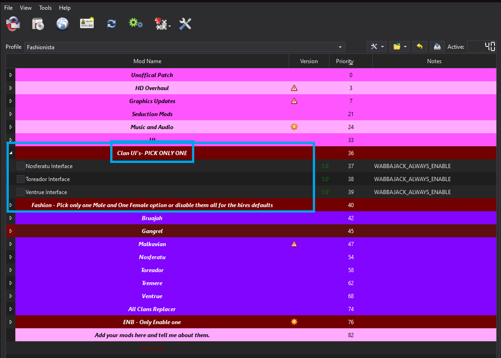
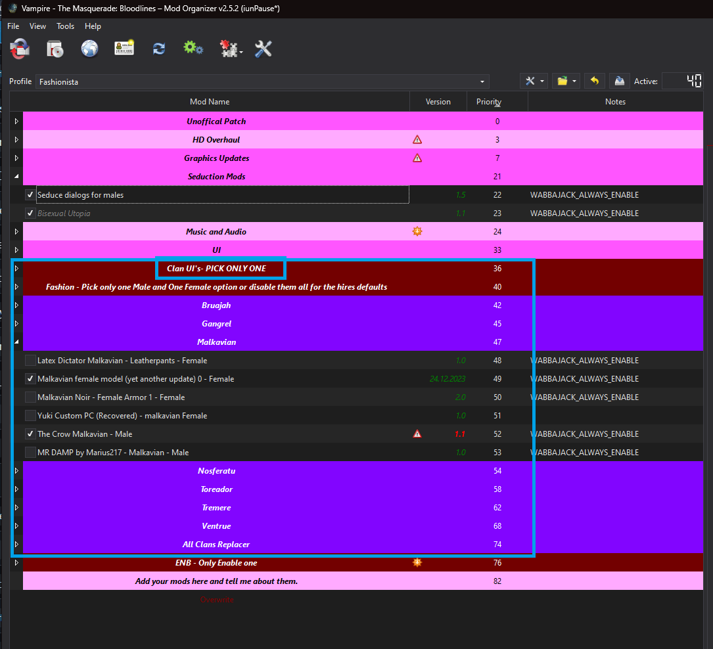
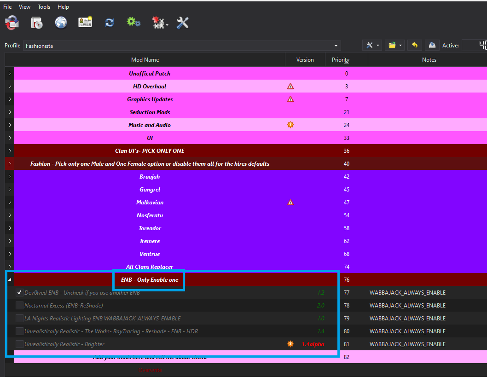
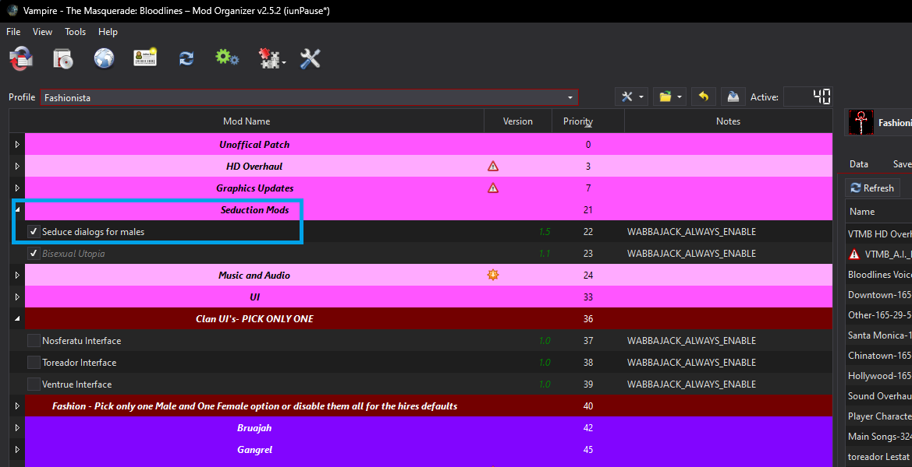
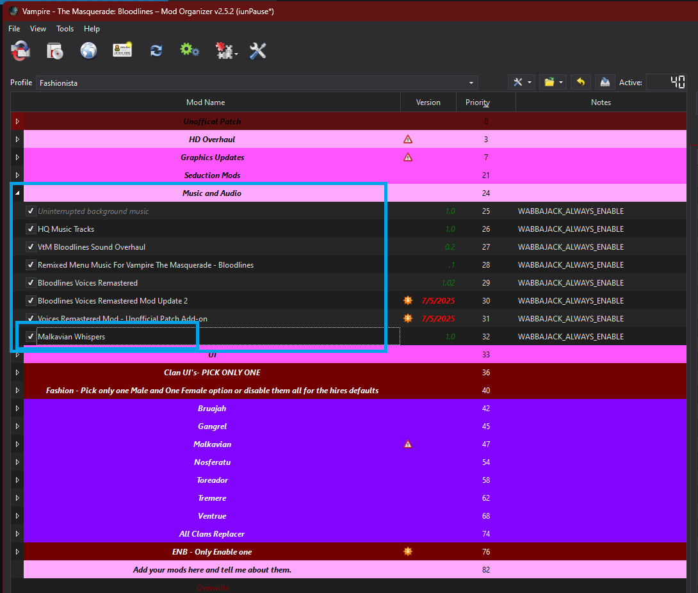

# Customize List

The list has several additional mods, that you can enable or turn off, to customze the experiance to your liking by enabling or disabling in the mods in the left hand panel.

### Custom Clan UI

This section is where you can enable a custom UI for a specific clan. Not all clans have one, but it's a nice touch if you plan on playing a supported clan. **Make sure you select only one option.**  

### Fashion

This section is for custom looks for the PC (Player Character). I have it broken down by clan and set it up to have a Male or Female tag at the end. Most of the time you should **only activate one male and one female option** per area, or at the end there is an area for mods that cover all clans.  

  

To see all the outfits and armors that I have added you can look here:  

[All Fashion](Fashion.md)

### ENB

The ENB I have selected is a good general ENB, but I have added a couple extra if you wish to try them instead.

The default shortcut to enable or disable the ENB is Shift + F12.

If you want to use one of the other ENBs you would have to:

- Uncheck **Dev0lved ENB**
- Check the other ENB you wish to try.

## How to Disable Same Sex Options for Males

The following mod is enabled and will set it so that you will have a male partner for the opening of the game as well as change a bunch of traits and alter dialogue to allow homosexual options  

`The Seduce dialogs for males`  

If you do not want this, just disable the mod.

## Malkavian Whispers

I added a mod that has random crazy talk, and notifications show up in the corner of the screen.

I find this hilarious and it works well with the vibe of the Clan, but I can see it being annoying for some people, if you would like to turn this off you can just disable the  

`Malkavian Whispers`  

mod in the left panel of Mod Organizer.

