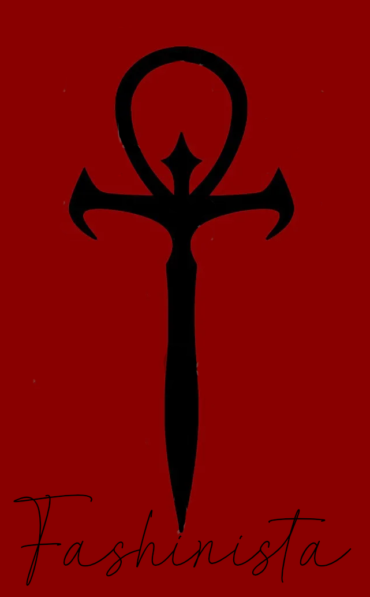

# VtMB---Fashionista

First things first: **this list contains adult content and you must be of legal age in your country. This means 18+ in most countries, 21+ in others. It is up to you to be sure of the age requirement in your country.**

# What is Fashionista?
Fashionista is a Vampire the Masqurade Bloodlines list that I put together so when I reinstall the game every 6 months I don't have to redo my mod setup, its here incase other people are like me.

# When is the List updated?
Its updated when someone tells me something is broken and I can fix it or I start another play through and look for new mods or update the unofficial patch.

# Quick Links
:arrow_down: [All Manual Downloads](https://github.com/iAmMe27/Merethic/wiki)

:file_folder: [Known Problematic Downloads](ProblematicFiles.md)

:exclamation: [Common Issues](CommonIssues.md)

# Need Support?

# Contents
- [What is Fashionista?](#what-is-Fashionista)
- [Quick Links](#quick-links)
- [Need Support?](#need-support)
- [Contents](#contents)
- [Preface](#preface)
- [Hardware Requirements](#hardware-requirements)
  - [Storage Space](#storage-space)
- [You Will Need](#you-will-need)
- [Pre-Installation](#pre-installation)
  - [Install Microsoft Visual C++ Redistributable Packages](#install-microsoft-visual-c-redistributable-packages)
  - [Setup your Antivirus](#setup-your-antivirus)
  - [Setup your Page File](#setup-your-page-file)
  - [Disable Steam Overlay](#disable-steam-overlay)
  - [Set game language to English](#set-game-language-to-english)
  - [Change Steam's Updating Behavior](#change-steams-updating-behavior)
- [Installation](#installation)
  - [Commonly Failing Downloads](#commonly-failing-downloads)
- [Post-Installation](#post-installation)
  - [Creating a desktop shortcut](#creating-a-desktop-shortcut)
- [Mod Setup](#mod-setup)
- [Updating Merethic](#updating-merethic)
- [Uninstalling Merethic](#uninstalling-merethic)

# Preface
I made this for my use, I don't care if you don't like the way Malkavians look I like it.

1. As a modlist user, I expect some small efforts into fixing your own issues, mostly by searching the documentation provided here and by the Discord channels. It's very likely any issue you encounter has already been solved - if this is the case and it's well known, don't be surprised if you get ignored.
   
2. Support shouldn't be expected as instant - I have a full time job on top of this, if you ping me Muted.
   
3. Do not expect a 100% polished, well-balanced and "perfect" experience, I am but one person even if its just a small list..
   
4. We're modding a nearly 20 year old game here, please temper your expectations some.
   
5. Suggestions are fine but I have looked at everysingle mod on the Nexus for the list so there is a decent chance I looked at it and said no.

# Hardware Requirements

|             | CPU                                           | RAM                 | GPU                |
|-------------|-----------------------------------------------|---------------------|--------------------|
| What I have | AMD Ryzen 7 5800X3D 8-Core Processor 3.40 GHz | 32GB DDR4 @ 3200MHz | AMD Radeon RX 6950 |

## Storage Space

|             | Total Space   | Storage Type        |
|-------------|---------------|---------------------|
| Minimum     | 32GB          | SATA SSD            |
| Recommended | 60GB          | NVMe SSD            |

Your installation must be on an ***internal*** SSD. External SSDs & HDDs are too slow for modlists to run from, and if you ignore this and it runs slow I will point and laugh.

# You Will Need
  * A Nexus Premium Account if you do not want to click install 50 times.
  * Patience

# Pre-Installation

**This stuff needs to be done BEFORE starting the Wabbajack installation.**

## Install Microsoft Visual C++ Redistributable Packages
>[!CAUTION]
>MO2 needs this - don't skip it.
>
>[Download Visual C++ Redistributable Package.](https://docs.microsoft.com/en-us/cpp/windows/latest-supported-vc-redist?view=msvc-170)

## Setup your Antivirus
Before you say "I don't have an antivirus" - you do, it's built into Windows. You *need* to exclude your Wabbajack folder and your Merethic installation folder from your antivirus' real-time protection stuff as it will interfere with your install. It can and will interfere whilst you are playing too, causing poor performance and obvious stuttering.

> [!TIP]
> How do I do this, you ask? [Click here to find out how.](https://support.microsoft.com/en-gb/windows/add-an-exclusion-to-windows-security-811816c0-4dfd-af4a-47e4-c301afe13b26)

If you use another antivirus program, refer to their steps for adding an exclusion.

***If you use Webroot, BitDefender, Norton or Kaspersky, I recommend you stop using these as these programs ***actively*** interfere with modlists even when they are excluded. Plus, you're wasting your money.***

## Disable Steam Overlay
The Steam overlay is known to cause issues, especially when using ENBs. Do so by heading into Steam, right clicking on Skyrim in your game library and clicking **Properties** > **General** > **Deselect "Enable Steam Overlay while in-game"**.

## Set game language to English
Wabbajack and some/most of the modding tools out there only support English language versions of Skyrim. Right click on Skyrim in your game library and click **Properties** > **Language** > **Select English**.

## Change Steam's Updating Behavior
Do this by right clicking on Skyrim in your game library and clicking **Properties** > **Updates** > **Change Automatic Updates to "Only update this game when I launch it"**. Whilst you're in here, it's also recommended to disable Steam Cloud too.

# Installation
Installing the list is straight forward, Wabbajack will do most of the heavy lifting for you - you only have to tell it where to put stuff.

Set the installation location to a folder on the root of a drive, something like `C:\Fashionista`. Do not install it to one of the protected folders as mentioned earlier. The download location will have likely been filled in for you too - ensure it matches the directory you set for the installation location.

>[!TIP]
>**I recommend you keep your downloads outside of the Fashionista installation folder!** 

## Commonly Failing Downloads
Downloads from non-Nexus file hosts often refuse to download automatically via Wabbajack for reasons. 

TO DO 1. [All Manual Downloads are listed here.](https://github.com/iAmMe27/Merethic/wiki)
TO DO 2. [All known problematic files are listed here.](ProblematicFiles.md)

Download these files and place them *as they are* into the Resource Download folder.

# Post-Installation
After Wabbajack has given you the installation successful screen, you're free to close it. Navigate to the Fashionista installation folder and run MO2 by double-clicking `ModOrganizer.exe`.

>[!WARNING]
>**DO NOT UNDER ANY CIRCUMSTANCES RUN LOOT.**
> 
>The load order is exactly as intended out of the box and you do not need to change it.

## Creating a desktop shortcut
Open MO2, ensure **Fashionista** is selected in the dropdown and click the "Shortcut" button. From the small dropdown menu, click "Desktop".

# Mod Setup

TO DO

When starting a new game, create your character and once done, *DO NOTHING ELSE* and allow the mods to initialise.

1. Once initialised, open the MCM Config menu, navigate to the MCM Recorder menu and run `Part 1`. Play the recording and allow it to finish.
2. Save your game and reload.
3. Navigate to the same menu and run `Part 2`.
4. Save your game and reload.

# Updating Fashionista
When an update is released, please always check the [changelog](changelog.md) first. Backup your saves before you commit to any updates, Wabbajack doesn't usually touch save files, it does has the ability to delete them if it wanted to.

If you have added anything to this modlist at all, Wabbajack will also delete those. You should know how to stop it from doing this if you're going to add stuff to modlists.

# Uninstalling Fashionista
Just delete the Fashionista folder and it'll be gone.
