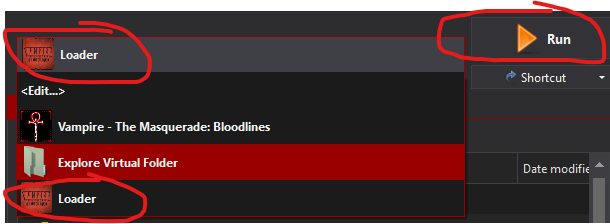
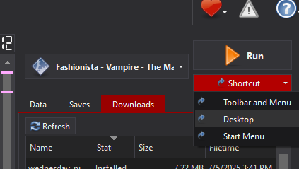
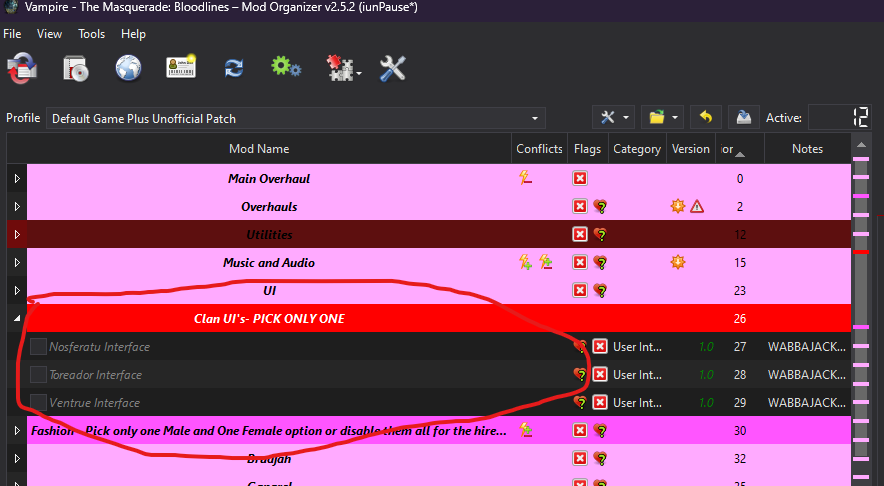
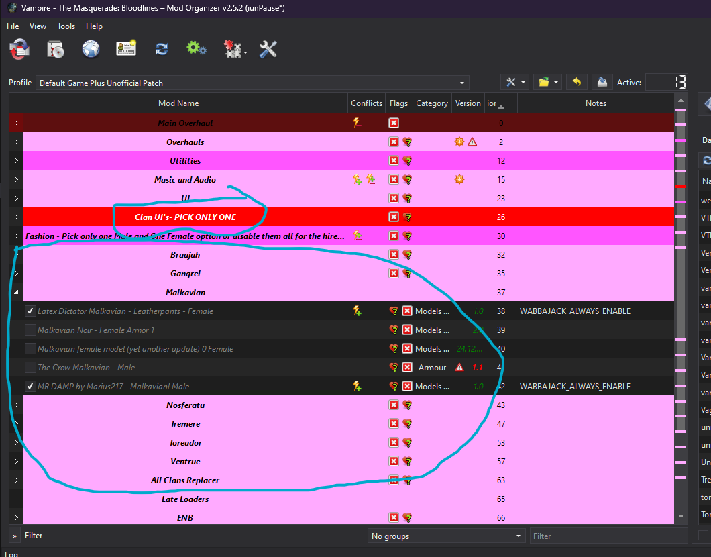

# VtMB---Fashionista

First things first: **this list contains adult content and you must be of legal age in your country. This means 18+ in most countries, 21+ in others. It is up to you to be sure of the age requirement in your country.**

## What is Fashionista?

Fashionista is a Vampire the Masquerade: Bloodlines list that I put together so when I reinstall the game every 6 months I don't have to redo my mod setup. It's here in case other people are like me. Its focus is a bit all over the place but it contains new content, better graphics, changes to the looks of the characters, changes to the UI, and a ton of bug fixes.

### When is the List updated?

It's updated when someone tells me something is broken and I can fix it, or I start another playthrough and look for new mods or the Unofficial Patch updates.

### Quick Links

:arrow_down: [All Manual Downloads](Files.md)

:file_folder: [Known Problematic Downloads](ProblematicFiles.md)

:exclamation: [Common Issues](ComonIssues.md)

### Need Support?

## Contents

- [What is Fashionista?](#what-is-fashionista)
- [When is the List updated](#when-is-the-list-updated)
- [Quick Links](#quick-links)
- [Need Support?](#need-support)
- [Contents](#contents)
- [Preface](#preface)
- [Hardware Requirements](#hardware-requirements)
  - [Storage Space](#storage-space)
- [You Will Need](#you-will-need)
- [Pre-Installation](#pre-installation)
  - [Install Microsoft Visual C++ Redistributable Packages](#install-microsoft-visual-c-redistributable-packages)
  - [Setup your Antivirus](#setup-your-antivirus)
  - [Disable Steam Overlay](#disable-steam-overlay)
- [Installation](#installation)
  - [Commonly Failing Downloads](#commonly-failing-downloads)
- [Post-Installation](#post-installation)
  - [Launch the Game](#launch-the-game)
  - [Creating a desktop shortcut](#creating-a-desktop-shortcut)
- [Optional Mod Setup](#optional-mod-setup)
  - [Custom Clan UI](#custom-clan-ui)
  - [Fashion](#fashion)
  - [ENB](#enb)
- [Alternative Profiles](#alternative-profiles)
  - [Default Game Plus Unofficial Patch](#default-game-plus-unofficial-patch---not-in-list-yet-still-in-dev)
  - [HD Overhaul](#hd-overhaul)
  - [To Come](#to-come)
- [Updating Fashionista](#updating-fashionista)
- [Uninstalling Fashionista](#uninstalling-fashionista)
- [Extra Notes about the List](#extra-notes-about-the-list)

## Preface

Some small notes about the list and the support and troubleshooting:

1. As a modlist user, I expect some small efforts into fixing your own issues, mostly by searching the documentation provided here and by the Discord channels. It's very likely any issue you encounter has already been solved—if this is the case and it's well known, don't be surprised if you get ignored.
2. Support shouldn't be expected as instant—I have a full-time job on top of this, be nice.
3. Do not expect a 100% polished, well-balanced, and "perfect" experience. I am but one person, even if it's just a small list... and this is a famously buggy game.
4. We're modding a nearly 20-year-old game here, please temper your expectations some.
5. Suggestions are fine, but I have looked at every single mod on the Nexus for the list so there is a decent chance I looked at it and said no. But there is always a chance, or it might be a new mod—they still do come out from time to time, or something I missed.

## Hardware Requirements

|             | CPU                                           | RAM                 | GPU                |
|-------------|-----------------------------------------------|---------------------|--------------------|
| What I have | AMD Ryzen 7 5800X3D 8-Core Processor 3.40 GHz | 32GB DDR4 @ 3200MHz | AMD Radeon RX 6950 |

It runs great with my system but it's probably fine on a potato.

### Storage Space

|             | Total Space   | Storage Type        |
|-------------|--------------|---------------------|
| Minimum     | 32GB         | SATA SSD            |
| Recommended | 60GB         | NVMe SSD            |

Your installation must be on an ***internal*** SSD or M.2 Drive. External SSDs & HDDs are too slow for modlists to run from, and I suggest an M.2 drive otherwise load and launch times are a bit longer than you would want.

## You Will Need

- A Nexus Premium Account if you do not want to click install 100 times.
- Patience

## Pre-Installation

**This stuff needs to be done BEFORE starting the Wabbajack installation.**

### Install Microsoft Visual C++ Redistributable Packages

> [!CAUTION]
> MO2 needs this—don't skip it.
>
> [Download Visual C++ Redistributable Package.](https://docs.microsoft.com/en-us/cpp/windows/latest-supported-vc-redist?view=msvc-170)

### Setup your Antivirus

Before you say "I don't have an antivirus"—you do, it's built into Windows. You *need* to exclude your Wabbajack folder and your Merethic installation folder from your antivirus' real-time protection as it will interfere with your install. It can and will interfere whilst you are playing too, causing poor performance and obvious stuttering.

> [!TIP]
> How do I do this, you ask? [Click here to find out how.](https://support.microsoft.com/en-gb/windows/add-an-exclusion-to-windows-security-811816c0-4dfd-af4a-47e4-c301afe13b26)

If you use another antivirus program, refer to their steps for adding an exclusion.

***If you use Webroot, BitDefender, Norton or Kaspersky, I recommend you stop using these as these programs ***actively*** interfere with modlists even when they are excluded. Plus, you're wasting your money.***

## Disable Steam Overlay

The Steam overlay is known to cause issues, especially when using ENBs. Do so by heading into Steam, right-clicking on Vampire: The Masquerade – Bloodlines in your game library and clicking **Properties** > **General** > **Deselect "Enable Steam Overlay while in-game"**.

## Installation

Installing the list has a couple of steps that you will have to follow for this to work.

Set the installation location to a folder on the root of a drive, something like `C:\Fashionista`. Do not install it to one of the protected folders as mentioned earlier. The download location will have likely been filled in for you too—ensure it matches the directory you set for the installation location.

> [!TIP]
> **I recommend you keep your downloads outside of the Fashionista installation folder!**

### Commonly Failing Downloads

Downloads from non-Nexus file hosts often refuse to download automatically via Wabbajack for various reasons.

!! This is a temp section only here in case it's needed. There are no commonly failing files I am aware of at this time.

TO DO 1. [All Manual Downloads are listed here.](https://github.com/daulvec/VtMB---Fashionista/wiki)  
TO DO 2. [All known problematic files are listed here.](ProblematicFiles.md)

Download these files and place them *as they are* into the Resource Download folder.

## Post-Installation

After Wabbajack has given you the installation successful screen, you're free to close it.

### Launch the game

Start by opening the folder you installed the list to and then run MO2 by double-clicking `ModOrganizer.exe`.  
Then select **Fashionista** in the drop-down if it's not already selected and launch the game.

> [!WARNING]
> **DO NOT UNDER ANY CIRCUMSTANCES RUN LOOT.**
>
> The load order is exactly as intended out of the box and you do not need to change it.  

Plus it only works for Skyrim so double don't use it.  

### Creating a desktop shortcut

Open MO2, ensure **Launch** is selected in the dropdown and click the "Shortcut" button. From the small dropdown menu, click "Desktop".  

  

## Optional Mod Setup

There are a couple of optional mods that you can enable or disable in the mod panel (the left panel in Mod Organizer).  

### Custom Clan UI

This section is where you can enable a custom UI for a specific clan. Not all clans have one, but it's a nice touch if you plan on playing a supported clan. Make sure you select only one option.  

### Fashion

This section is for custom looks for the PC (Player Character). I have it broken down by clan and set it up to have a Male or Female tag at the end. Most of the time you should only activate one male and one female option per area, or at the end there is an area for mods that cover all clans.  

  

To see all the outfits and armors that I have added you can look here:  

[All Fashion](Fashion.md)

### ENB

The ENB I have selected is a good general ENB but I have added a couple extra if you wish to try them instead.

The default shortcut to enable or disable the ENB is Shift + F12.

If you want to use one of the other ENBs you would have to:

- Uncheck **Dev0lved ENB**
- Check the other ENB you wish to try.

## Alternative Profiles

I added two additional profiles that you can use if you want. Just select the profile you want in the dropdown and launch the game as normal.

### Default Game Plus Unofficial Patch

For the people that want to experience the game as it originally was presented. The Unofficial Patch is included as the game is unbeatable without it.

### HD Overhaul

This is a large all-in-one overhaul. It contains HD textures for basically the full game, a new UI, new music, and its own Reshade.

### To Come

I plan on getting some other quest mods and expansions added to the game so I can play them eventually, such as the following:

- Clan Quest Mod
- Bloodlines Extreme
- VTMB Prelude
- Ming Xiao Romance
- Vampire The Masquerade: Bloodlines - RTX Remaster
  - This has been tested and is not working with the list. I will continue to work on it to see if we can get it working.

These will probably be required to be alternative profiles and I want to test them before I release them.

## Updating Fashionista

When an update is released, please always check the [changelog](changelog.md) first. Backup your saves before you commit to any updates. Wabbajack doesn't usually touch save files, but it does have the ability to delete them if it wanted to.

If you have added anything to this modlist at all, Wabbajack will also delete those. You should know how to stop it from doing this if you're going to add stuff to modlists.

## Uninstalling Fashionista

Just delete the Fashionista folder and it'll be gone.

## Gameplay Guide

[Gameplay Guide](Gameplay-Tips.md)